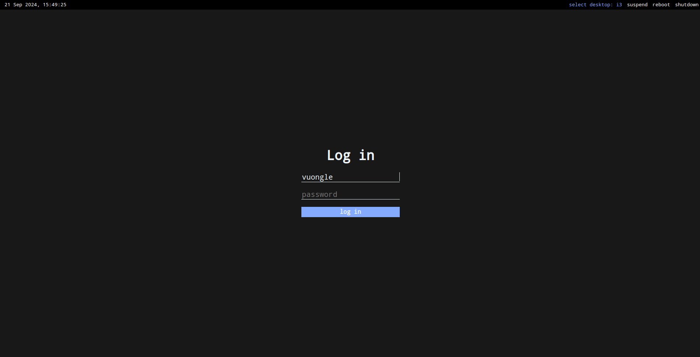

# Minimalistic lightdm-webkit2-greeter theme
Simple theme for lightdm display manager with webkit2 greeter.



## Installation
1. Clone or download this repo
2. Copy content of the repo to `/usr/share/lightdm-webkit/themes/minimal`
2. Install `lightdm` and `lightdm-webkit2-greeter`
4. Set webkit2 greeter as your greeter by editing file `/etc/lightdm/lightdm.conf`:
```
[Seat:*]
...
greeter-session=lightdm-webkit2-greeter
```

5. Set this theme as greeter theme by editing file `/etc/lightdm/lightdm-webkit2-greeter.conf`:
```
webkit_theme = minimal
```

Remake UI from [lightdm-webkit2-theme-minimal](https://github.com/dimaglushkov/lightdm-webkit2-theme-minimal.git)